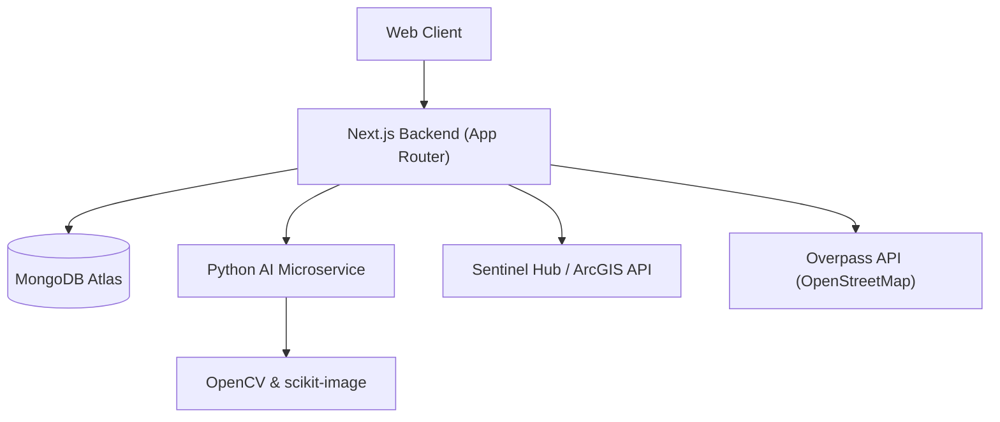

# CSIDC Industrial Land Monitoring System - Prototype Report

## 1. Executive Summary
This prototype demonstrates an **Automated Monitoring and Compliance System** for the Chhattisgarh State Industrial Development Corporation (CSIDC). It leverages **Satellite Imagery (Sentinel-2/ArcGIS)** and **AI-powered Computer Vision** to detect land encroachment, monitor construction progress, and assess environmental risks for industrial allocattees.

## 2. System Architecture
The system follows a **Service-Oriented Architecture (SOA)** with two main components:

-   **Frontend & Orchestration Layer (Web App)**: Handles UI, user management, database interactions, and orchestrates calls to external APIs.
-   **AI Microservice**: A dedicated Python service for heavy image processing and computer vision tasks.

### Architecture Diagram

## 3. Technology Stack

### Frontend & Web Server
-   **Framework**: Next.js 16 (React 19, App Router)
-   **Styling**: Tailwind CSS v4, shadcn/ui components
-   **Maps**: Leaflet.js, React-Leaflet
-   **Language**: TypeScript
-   **Icons**: Lucide React
-   **Theme**: Custom "Geographic Blue" Technical Theme (OKLCH color space)

### Backend Services
-   **Database**: MongoDB (Mongoose ODM)
-   **AI Service**: Python FastAPI
-   **Image Processing**: OpenCV, scikit-image, NumPy, Pillow
-   **Satellite Data**: Sentinel-2 (via Sentinel Hub), ArcGIS World Imagery
-   **Geo-Data**: OpenStreetMap (Overpass API)

## 4. Key Features Implemented

### A. Dashboard & Live Map
-   **Interactive Map**: Visualizes industrial plots with color-coded status (Compliant/Violation).
-   **Industry Control Panel**: Logic to select specific industries (e.g., Rikhi, Tilda) and view their location.
-   **Dynamic Opacity Slider**: Allows users to overlay blueprint images onto satellite maps for visual inspection.

### B. Automated Compliance Checks
-   **AI-Powered Analysis**: Uploads industry blueprints and compares them against satellite imagery.
-   **Encroachment Detection**: Calculates deviation percentage using Structural Similarity Index (SSIM) and contour analysis.
-   **Red-Flagging**: Automatically flags industries with >5% deviation or unauthorized construction.
-   **Report Generation**: Creates detailed compliance reports with "Heatmap" evidence images.

### C. Construction Progress Monitoring
-   **Time-Series Analysis**: Tracks development status (Land Clearing -> Foundation -> Structure).
-   **Visual Comparison**: Side-by-side view of "Previous State" vs. "Current Status" using historical and current satellite/site photos.
-   **Progress Table**: Auto-updates status based on visual evidence.

### D. Environmental Risk Assessment
-   **Proximity Analysis**: Scans a 5km radius around the industry.
-   **Risk Identification**: Detects nearby Thermal Power Plants, Chemical Industries, and Waste Retrieval Sites.
-   **Risk Grading**: Categorizes location risk as Low, Moderate, or High based on the density of hazardous facilities.

### E. Management Dashboards
-   **Violations Dashboard**: Centralized view of all non-compliant industries for quick action.
-   **Settings Dashboard**: Configurable thresholds for AI sensitivity and notification preferences (simulated).

## 5. Data Models
-   **Industry**: Stores static data (Bounds, Name, Blueprint URL, Progress Photos).
-   **Report**: Stores dynamic analysis results (`deviation_percentage`, `confidence_score`), generated heatmaps, and survey details.

## 6. Future Prospects & Scalability

1.  **Drone Integration**: API endpoints to ingest high-resolution drone orthomosaics for significantly higher precision (<5cm accuracy).
2.  **Predictive Analytics**: Use historical data to predict which industries are likely to violate norms based on growth patterns.
3.  **App Integration**: Mobile app for field officers to upload geo-tagged "Ground Truth" photos directly to the report.
4.  **Blockchain Ledger**: Store immutable records of compliance certificates for transparency.
5.  **Automated Notices**: Integrate with email/SMS gateways to automatically serve legal notices upon confirmed violation.

## 7. Configuration Guide
-   **Web App**: `npm run dev` (Port 3000)
-   **AI Service**: `uvicorn main:app --reload` (Port 8000)
-   **Env Variables**: `MONGODB_URI`, `NEXTAUTH_SECRET`, `SENTINEL_CLIENT_ID`, `SENTINEL_CLIENT_SECRET`.

---
